# CozyKeys
This is a full-stack property rental and booking platform where users can discover, list, and reserve short-term stays. The application is built using the MERN stack, providing a seamless experience for both guests and hosts.


## Features & Integrations

| Feature/Integration         | Purpose/Use Case                                      |
|----------------------------|-------------------------------------------------------|
| **Passport.js**            | User authentication                                   |
| **Session & Cookies**      | Maintain login state                                  |
| **JWT**                    | Token-based authentication (if implemented)           |
| **Password Hashing**       | Secure password storage                               |
| **Multer**                 | File uploads (images)                                 |
| **Cloudinary**             | Cloud image storage                                   |
| **Mapbox Geocoding**       | Convert address to coordinates                        |
| **Mapbox GL JS**           | Render maps on frontend                               |
| **MongoDB**                | Persistent data storage                               |
| **Mongoose**               | Data modeling and validation                          |
| **EJS**                    | Dynamic HTML rendering                                |
| **Bootstrap/Custom CSS/JS**| UI and interactivity                                  |
| **Joi**                    | Data validation (if used)                             |
| **Custom Middleware**      | Error/auth/data validation handling                   |
| **Flash Messages**         | User feedback                                         |
| **MVC Pattern**            | Code organization                                     |
| **Express Routers**        | RESTful API routing                                   |
| **Seed Scripts**           | Initial data population                               |
| **.env/.gitignore**        | Security and best practices                           |

---

## Getting Started

1. **Clone the repository:**
   ```bash
   git clone https://github.com/yourusername/cozykeys.git
   cd cozykeys
   ```

2. **Install dependencies:**
   ```bash
   npm install
   ```

3. **Set up environment variables:**
   - Create a `.env` file in the root directory.
   - Add your MongoDB URI, Mapbox token, Cloudinary credentials, and session secret.

4. **Run the application:**
   ```bash
   npm start
   ```

5. **Access the app:**
   - Visit `http://localhost:3000` in your browser.

---

## Folder Structure

- `models/` – Mongoose schemas for Users, Listings, Reviews
- `controllers/` – Business logic for each resource
- `routes/` – Express routers for users, listings, reviews
- `views/` – EJS templates for UI
- `public/` – Static assets (CSS, JS)
- `utils/` – Utility functions and error handling
- `init/` – Database seeding scripts

---

## Security

- Sensitive credentials are stored in `.env` (not tracked by git).
- Passwords are securely hashed.
- User authentication and session management are implemented.

---

## License

MIT


# CozyKeys

CozyKeys is a full-stack web application for managing property listings, including rentals and real estate, with a focus on user-friendly interactions and robust backend architecture.

## 🏗️ Architecture Overview

### Complete System Architecture

```mermaid
graph TB
    %% Client Layer
    Client["`**Client Browser**<br/>User Interface`"]
    
    %% Presentation Layer
    subgraph Views["`**View Layer (EJS Templates)**`"]
        ListingViews["`**Listing Views**<br/>• index.ejs<br/>• show.ejs<br/>• new.ejs<br/>• edit.ejs`"]
        UserViews["`**User Views**<br/>• login.ejs<br/>• signup.ejs`"]
        SharedViews["`**Shared Components**<br/>• navbar.ejs<br/>• footer.ejs<br/>• flash.ejs<br/>• boilerplate.ejs`"]
    end
    
    %% Static Assets
    StaticAssets["`**Static Assets**<br/>• CSS (style.css, map.css)<br/>• JavaScript (script.js, map.js)<br/>• Images`"]
    
    %% Application Layer
    subgraph AppLayer["`**Express.js Application Layer**`"]
        ExpressApp["`**Express App (app.js)**<br/>• Session Management<br/>• Authentication Setup<br/>• Route Registration<br/>• Error Handling`"]
        
        subgraph Routes["`**Route Layer**`"]
            ListingRoutes["`**Listing Routes**<br/>GET /listings<br/>POST /listings<br/>GET /listings/:id<br/>PUT /listings/:id<br/>DELETE /listings/:id`"]
            UserRoutes["`**User Routes**<br/>GET /signup<br/>POST /signup<br/>GET /login<br/>POST /login<br/>GET /logout`"]
            ReviewRoutes["`**Review Routes**<br/>POST /listings/:id/reviews<br/>DELETE /listings/:id/reviews/:reviewId`"]
        end
        
        subgraph Middleware["`**Middleware Layer**`"]
            AuthMiddleware["`**Authentication**<br/>• isLoggedIn<br/>• isOwner<br/>• isReviewAuthor`"]
            ValidationMiddleware["`**Validation**<br/>• validateListing<br/>• validateReview`"]
            FileUpload["`**File Upload**<br/>• Multer<br/>• Cloudinary Storage`"]
        end
        
        subgraph Controllers["`**Controller Layer**`"]
            ListingController["`**Listing Controller**<br/>• index<br/>• createListing<br/>• showListing<br/>• updateListing<br/>• deleteListing<br/>• searchListings`"]
            UserController["`**User Controller**<br/>• signup<br/>• login<br/>• logout`"]
            ReviewController["`**Review Controller**<br/>• createReview<br/>• destroyReview`"]
        end
    end
    
    %% Data Layer
    subgraph DataLayer["`**Data Access Layer**`"]
        subgraph Models["`**Mongoose Models**`"]
            UserModel["`**User Model**<br/>• email<br/>• username (via passport)<br/>• password (hashed)`"]
            ListingModel["`**Listing Model**<br/>• title, description<br/>• image (Cloudinary URL)<br/>• price, location, country<br/>• geometry (coordinates)<br/>• owner (User ref)<br/>• reviews (Review refs)`"]
            ReviewModel["`**Review Model**<br/>• comment<br/>• rating (1-5)<br/>• author (User ref)<br/>• createdAt`"]
        end
    end
    
    %% Database Layer
    MongoDB["`**MongoDB Database**<br/>• Users Collection<br/>• Listings Collection<br/>• Reviews Collection`"]
    
    %% External Services
    subgraph ExternalServices["`**External Services**`"]
        Cloudinary["`**Cloudinary**<br/>Image Storage & CDN`"]
        MapboxGeo["`**Mapbox Geocoding**<br/>Address to Coordinates`"]
        MapboxMap["`**Mapbox GL JS**<br/>Map Rendering`"]
    end
    
    %% Authentication
    subgraph AuthSystem["`**Authentication System**`"]
        PassportJS["`**Passport.js**<br/>• Local Strategy<br/>• Session Management<br/>• User Serialization`"]
        Sessions["`**Express Sessions**<br/>• Session Store<br/>• Flash Messages`"]
    end
    
    %% Connections
    Client --> StaticAssets
    Client --> ExpressApp
    
    ExpressApp --> Routes
    Routes --> Middleware
    Middleware --> Controllers
    Controllers --> Models
    Models --> MongoDB
    
    ExpressApp --> Views
    Views --> Client
    
    ExpressApp --> AuthSystem
    AuthSystem --> UserModel
    
    FileUpload --> Cloudinary
    ListingController --> MapboxGeo
    Client --> MapboxMap
    
    %% Data Flow Arrows
    ListingController -.->|"Geocode Addresses"| MapboxGeo
    Controllers -.->|"Upload Images"| Cloudinary
    Controllers -.->|"CRUD Operations"| MongoDB
    AuthMiddleware -.->|"Session Validation"| Sessions
```



## 🔄 Application Flow

### **User Registration/Login Flow**:
1. User visits `/signup` or `/login`
2. Form submission hits user routes
3. Passport.js handles authentication
4. User session established
5. Redirect to listings page

### **Property Listing Flow**:
1. User creates new listing (`/listings/new`)
2. Form with image upload submitted
3. Image uploaded to Cloudinary via Multer
4. Address geocoded using Mapbox API
5. Listing saved to MongoDB with coordinates
6. User redirected to listings index

### **Property Viewing Flow**:
1. User visits property page (`/listings/:id`)
2. Listing populated with reviews and owner data
3. Map rendered with property location
4. Reviews displayed with author information

### **Review System Flow**:
1. Authenticated user posts review
2. Review linked to listing and user
3. Review added to listing's reviews array
4. Page refreshed to show new review

## 📊 Key Technologies & Features

| Technology | Purpose | Implementation |
|------------|---------|----------------|
| **Express.js** | Web framework and routing | Main server framework with middleware |
| **MongoDB/Mongoose** | Database and ODM | Document storage with schema validation |
| **EJS** | Server-side templating | Dynamic HTML rendering |
| **Passport.js** | Authentication | Local strategy with session management |
| **Cloudinary** | Image storage | Cloud-based image upload and CDN |
| **Mapbox** | Geocoding and mapping | Address conversion and interactive maps |
| **Multer** | File upload handling | Multipart form data processing |
| **Joi** | Data validation | Schema-based request validation |
| **Flash Messages** | User feedback | Session-based notification system |
| **Custom Middleware** | Security & validation | Authentication and authorization checks |

## 🏗️ **Architecture Layers**

### **1. Client Layer**
- **Browser Interface**: Users interact through web browsers
- **Static Assets**: CSS, JavaScript, and images served from `/public` directory
- **Mapbox Integration**: Interactive maps for property locations

### **2. Presentation Layer (EJS Templates)**
- **Listing Views**: Property display, creation, editing, and search interfaces
- **User Views**: Authentication forms (login/signup)
- **Shared Components**: Reusable templates (navbar, footer, flash messages)
- **Layout System**: Boilerplate template for consistent UI structure

### **3. Application Layer (Express.js)**

**Main Application (`app.js`)**:
- Session management with express-session
- Passport.js authentication setup
- Route registration and middleware mounting
- Global error handling
- Database connection management

**Route Layer**:
- **Listing Routes**: Full CRUD operations for properties (`/listings`)
- **User Routes**: Authentication endpoints (`/signup`, `/login`, `/logout`)
- **Review Routes**: Nested routes for property reviews (`/listings/:id/reviews`)

**Middleware Layer**:
- **Authentication**: `isLoggedIn`, `isOwner`, `isReviewAuthor`
- **Validation**: Joi schema validation for listings and reviews
- **File Upload**: Multer integration with Cloudinary storage

**Controller Layer**:
- **Listing Controller**: Business logic for property operations, geocoding
- **User Controller**: User registration, login, logout logic
- **Review Controller**: Review creation and deletion logic

### **4. Data Access Layer**

**Mongoose Models**:
- **User Model**: Email, username, encrypted passwords via passport-local-mongoose
- **Listing Model**: Property details, images, location coordinates, owner/review references
- **Review Model**: Comments, ratings, author references, timestamps

### **5. Database Layer**
- **MongoDB**: Document-based storage for users, listings, and reviews
- **Relationships**: Populated references between users, listings, and reviews

### **6. External Services Integration**
- **Cloudinary**: Image upload, storage, and CDN delivery
- **Mapbox Geocoding**: Address-to-coordinate conversion
- **Mapbox GL JS**: Interactive map rendering in browser

### **7. Authentication System**
- **Passport.js**: Local strategy for username/password authentication
- **Express Sessions**: Server-side session management
- **Flash Messages**: User feedback system

## 🛡️ **Security Features**

- **Password Hashing**: Automatic via passport-local-mongoose
- **Session Management**: Secure session storage
- **Authorization Middleware**: Route-level access control
- **Input Validation**: Joi schema validation
- **Error Handling**: Comprehensive error catching and user feedback
- **Environment Variables**: Sensitive credentials stored in `.env` (not tracked by git)

## 📁 **Folder Structure**

```
CozyKeys/
├── controllers/          # Business logic for each resource
│   ├── listings.js      # Listing CRUD operations
│   ├── reviews.js       # Review management
│   └── users.js         # User authentication
├── models/              # Mongoose schemas
│   ├── listing.js       # Property data model
│   ├── review.js        # Review data model
│   └── user.js          # User data model
├── routes/              # Express routers
│   ├── listing.js       # Listing routes
│   ├── review.js        # Review routes
│   └── user.js          # Authentication routes
├── views/               # EJS templates
│   ├── layouts/         # Base templates
│   ├── listings/        # Property views
│   ├── users/           # Auth views
│   └── includes/        # Shared components
├── public/              # Static assets
│   ├── css/            # Stylesheets
│   └── js/             # Client-side JavaScript
├── utils/               # Utility functions
├── init/                # Database seeding scripts
├── middleware.js        # Custom middleware
├── app.js              # Main application file
└── cloudConfig.js      # Cloudinary configuration
```

## 🚀 **Getting Started**

### **Prerequisites**
- Node.js (v14 or higher)
- MongoDB
- Cloudinary account
- Mapbox account

### **Installation**

1. **Clone the repository:**
   ```bash
   git clone https://github.com/yourusername/cozykeys.git
   cd cozykeys
   ```

2. **Install dependencies:**
   ```bash
   npm install
   ```

3. **Set up environment variables:**
   Create a `.env` file in the root directory and add:
   ```env
   PORT=8080
   MAP_TOKEN=your_mapbox_token
   CLOUD_NAME=your_cloudinary_cloud_name
   CLOUD_API_KEY=your_cloudinary_api_key
   CLOUD_API_SECRET=your_cloudinary_api_secret
   SESSION_SECRET=your_session_secret
   ```

4. **Start MongoDB:**
   ```bash
   mongod
   ```

5. **Run the application:**
   ```bash
   npm start
   # or for development
   npm run dev
   ```

6. **Access the app:**
   - Visit `http://localhost:8080` in your browser

## 🔧 **API Endpoints**

### **Authentication Routes**
- `GET /signup` - Signup form
- `POST /signup` - User registration
- `GET /login` - Login form
- `POST /login` - User authentication
- `GET /logout` - User logout

### **Listing Routes**
- `GET /listings` - View all listings
- `GET /listings/new` - New listing form
- `POST /listings` - Create new listing
- `GET /listings/:id` - View specific listing
- `GET /listings/:id/edit` - Edit listing form
- `PUT /listings/:id` - Update listing
- `DELETE /listings/:id` - Delete listing
- `GET /listings/search` - Search listings

### **Review Routes**
- `POST /listings/:id/reviews` - Add review
- `DELETE /listings/:id/reviews/:reviewId` - Delete review

## 🧪 **Development**

### **Running in Development Mode**
```bash
npm run dev
```

### **Database Seeding**
```bash
node init/index.js
```

## 📋 **Features**

- ✅ User registration and authentication
- ✅ Property listing CRUD operations
- ✅ Image upload with Cloudinary
- ✅ Interactive maps with Mapbox
- ✅ Property search functionality
- ✅ User reviews and ratings
- ✅ Responsive design
- ✅ Session management
- ✅ Flash messaging
- ✅ Data validation
- ✅ Error handling

## 🚀 **Deployment Ready Features**

- Environment variable configuration
- Error handling and logging
- Session security settings
- Database connection management
- Static asset serving
- Production-ready middleware stack

---

## 📄 **License**

MIT License - see LICENSE file for details
